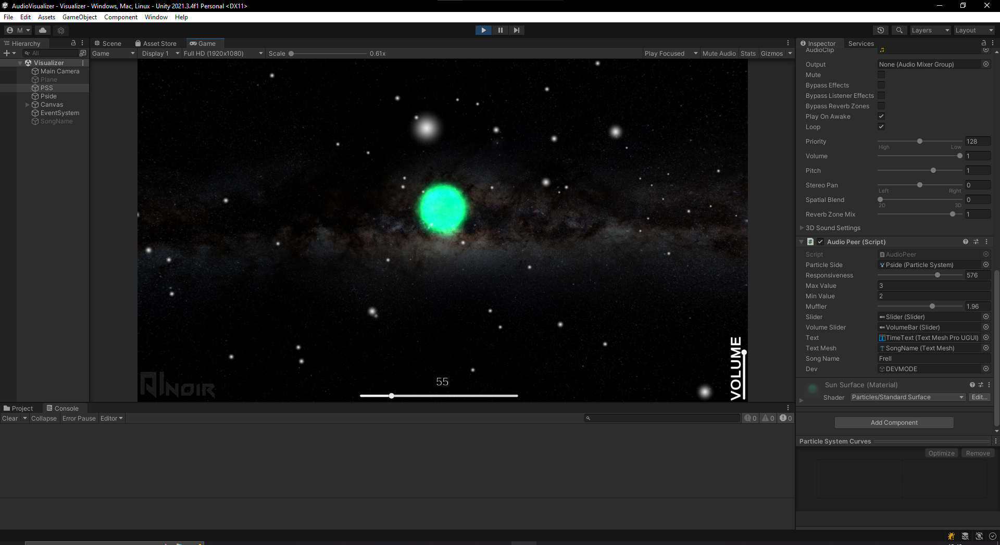

# AISY
AISY is a solution for audio visualization (realtime). It's based on Unity Engine (Editor Version 2021.3.4f1). 
AISY use average value of samples from FFT (Fast Fourier transformation).
Using this value you can change vectors or colors of objects. You can use mp3 or wav files for visualization. 
# Gallery
Test main menu:

First test scene:

Visualization example:
https://streamable.com/fg7w1y
